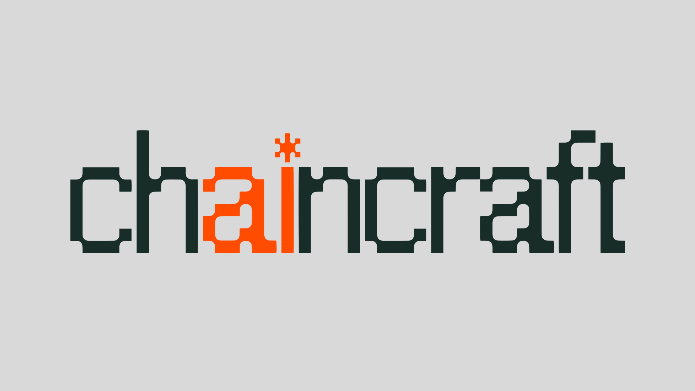

  

<h3 align="center">⚔️ Describe an idea. AI builds the game. You own it. ⚔️</h3>

  <strong>AI-powered game creation &amp; publishing on Arbitrum — browser &amp; mobile, multiplayer, no downloads.</strong>

---

## What is Chaincraft?

Great game ideas die because testing even one mechanic requires building an entire game first. **Chaincraft fixes that.**

Describe your idea — our AI builds a playable, multiplayer game around it in minutes. No installs. No downloads. Just play.

---

## ✨ Key Features

- 🤖 **AI-powered game creation** — describe an idea, get a playable game in minutes
- 📱 **Browser & mobile first** — play instantly, no installs required
- 👥 **Multiplayer out of the box** — invite friends to play or spectate from mobile
- ⏸️ **Persistent sessions** — leave a game mid-session, come back later right where you left off
- 🎭 **AI inside games** — AI characters, narration, and AI-driven outcomes (not just AI for building)
- 🏆 **Token Duels** — skill-based wagering with revenue splits between winner, platform, and game creator
- 🎒 **Cross-game item interoperability** — items created in one game can be used in another
- 🔗 **Real creator ownership** — every published game is minted as an ERC-721 NFT on Arbitrum; you own your ideas
- 🌍 **Open source core** — the game builder and engine are open source; we grow with the community

---

## 💰 How Creators Earn

| Revenue Stream | How It Works |
|---|---|
| 🏆 **Token Duels** | Skill-based competitions; revenue split between winner, platform, and game creator |
| 🎒 **Item Economy** | Create & sell in-game items and card packs as NFTs; earn royalties on resales |
| 🌟 **Creator Subscriptions** | Fans support creators directly and receive perks *(coming soon)* |

---

## 🗂️ Our Repositories

### 🌐 Public

| Repo | Description |
|---|---|
| [**game-builder**](https://github.com/chaincraftgames/game-builder) | Our AI-powered game creator — hosts a web API and Discord bot for creating games, plus our AI-powered game simulation engine |
| [**chaincraft-contracts**](https://github.com/chaincraftgames/chaincraft-contracts) | Diamond proxy-based smart contract system for managing game NFTs. Each game is published as an ERC-721 token with a unique UUID, with on-chain metadata management and user consent via EIP-712 signatures |
| [**text-game-engine**](https://github.com/chaincraftgames/text-game-engine) | Our ECS-based game engine used by Chaincraft games to handle player interaction and game logic — designed for text, card, board, and other turn-based game formats |

### 🔒 Private

| Repo | Description |
|---|---|
| **chaincraft-frontend** | Our Next.js app where users create, test, publish, and play games on the Chaincraft platform |
| **chaincraft-orchestrator** | Our Supabase-backed server that bridges the app and backend services including the game builder and blockchain |

> Other repos in this organization are prototypes or experiments and are not actively maintained.

---

## 🎮 Play & Get Involved

| | |
|---|---|
| 🎮 **Play now** | [play.chaincraft.games](https://play.chaincraft.games) |
| 🌐 **Website** | [chaincraft.games](https://chaincraft.games) |
| 💬 **Discord** | [discord.gg/72GuUnYxcE](https://discord.gg/72GuUnYxcE) |
| 🐦 **Twitter/X** | [x.com/chaincraftgames](https://x.com/chaincraftgames) |
| 📸 **Instagram** | [instagram.com/chaincraftgames](https://www.instagram.com/chaincraftgames) |
| 🟣 **Warpcast** | [warpcast.com/~/channel/chaincraft](https://warpcast.com/~/channel/chaincraft) |
| 💼 **LinkedIn** | [linkedin.com/company/chaincraftgames](https://www.linkedin.com/company/chaincraftgames/) |

---

## 🤝 Contribute

We build in public and love the community. Want to get involved?

- Browse the open issues in [game-builder](https://github.com/chaincraftgames/game-builder/issues) or [text-game-engine](https://github.com/chaincraftgames/text-game-engine/issues)
- Open an issue if you have an idea, bug report, or feature request
- Jump into our [Discord](https://discord.gg/72GuUnYxcE) and say hi — it's the best place to connect with the team and other builders

*Built with ❤️, pixel art, and way too much coffee.*
